# RAGBot Astra

Welcome to DataStax Gen AI Dev Jam. This Dev Jam will help you quickly become familiar with DataStax RAGStack, LLMs and Astra Vector Database. These hands-on jam normally runs with a DataStax technical coach, self-paced and hands-on learning assignments. Bring in a Gen AI use case, your data and build a Gen AI chatbot using DataStax Astra platform.
This project is a starter for creating your production ready chatbot using Astra DB, Vercel, Next.js and OpenAI. It's designed to be easy to deploy and use, with a focus on performance and usability. Let's Go!

## What you'll learn:

- 🚀 How to use Astra DB Vector Store for Semantic Similarity search
- 🤖 How to use OpenAI's Large Language Models for Q&A style chatbots
- Vercel:  How to use Vercel to deploy the ChatBot

## Features

- **Astra DB Integration**: Store and retrieve data from your Astra DB database with ease.
- **OpenAI Integration**: Leverage the power of OpenAI to generate intelligent responses.
- **Easy Deployment**: Deploy your chatbot to Vercel with just a few clicks.
- **Customizable**: Modify and extend the chatbot to suit your needs.

## Getting Started

### Prerequisites

This workshop assumes you have access to:
1. [A Github account](https://github.com)
2. [Google Colab](https://colab.research.google.com/)

Follow the below steps and provide the **Astra DB API Endpoint**, **Astra DB ApplicationToken** and **OpenAI API Key** when required.

### Sign up for Astra DB

Make sure you have a vector-capable Astra database (get one for free at [astra.datastax.com](https://astra.datastax.com/register))

- Once you create an Astra account, enable the new developer preview experience as below.

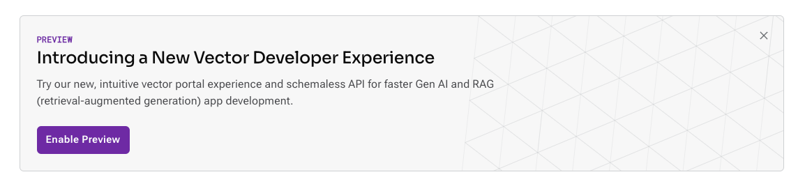


- Create a Astra Vector database as below


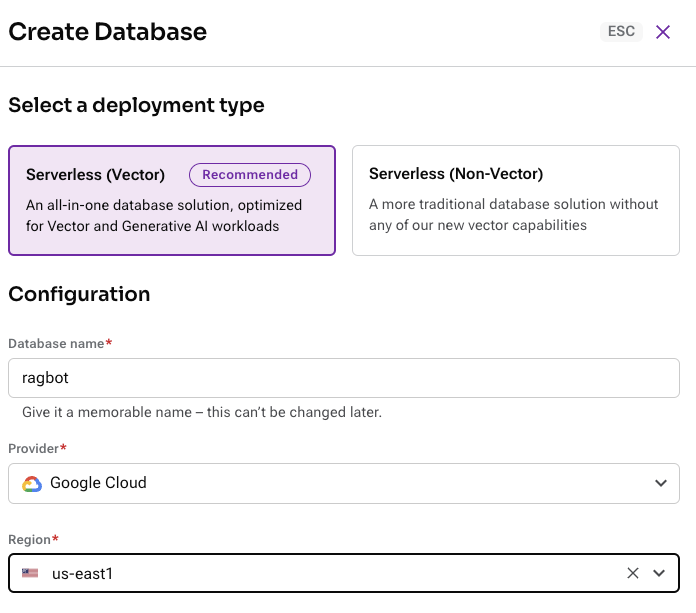


- Wait for the DB to initialized and be ready


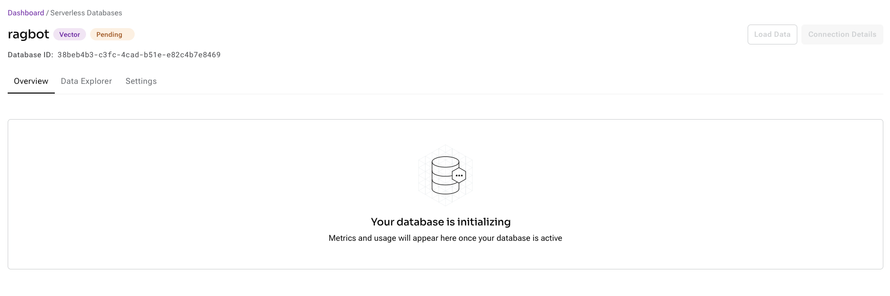


- Explore connectivity options using Java, Python and Typescript


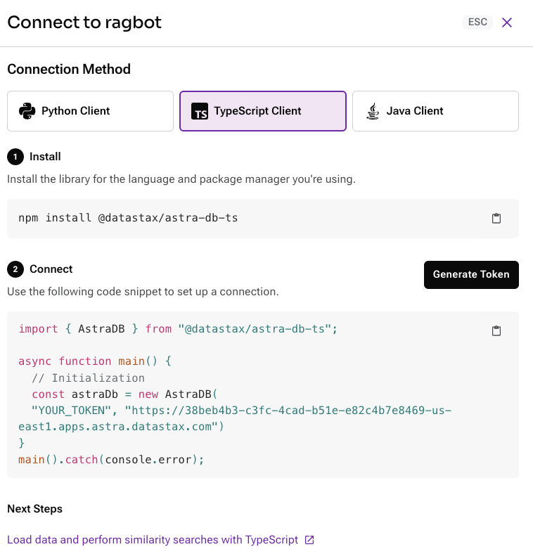


- Key information you will need shortly, explore them.
- You will be asked to provide the **API Endpoint** which can be found in the right pane underneath *Database details*.
- Ensure you have an **Application Token** for your database which can be created in the right pane underneath *Database details*.

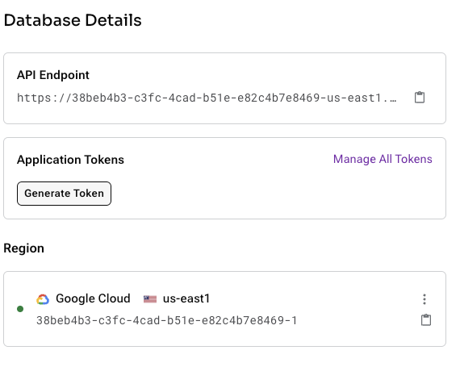


- You will need DB ID.


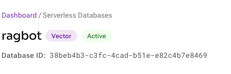


### Sign up for OpenAI

- Create an [OpenAI account](https://platform.openai.com/signup) or [sign in](https://platform.openai.com/login).
- Navigate to the [API key page](https://platform.openai.com/account/api-keys) and create a new **Secret Key**, optionally naming the key.


### Sign up for Vercel

- Sign Up here with your gmail or github with Vercel [here](https://vercel.com/new/krishnan-narayana-swamys-projects).

## Setup

To make life easier, we'll use the awesome Github functionality. Github offers you a completely integrated developer experience and resources to get started quickly. How?

1. Open the [ragbot-astra-jam](https://github.com/krishnannarayanaswamy/ragbot-astra-jam) repository

2. Click on `Use this template`->`Create new repository` as follows:

    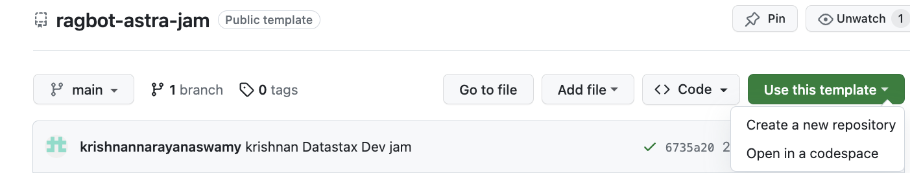

3. Now select your github account and name the new repository. Ideally also set the description. Click `Create new repository`

    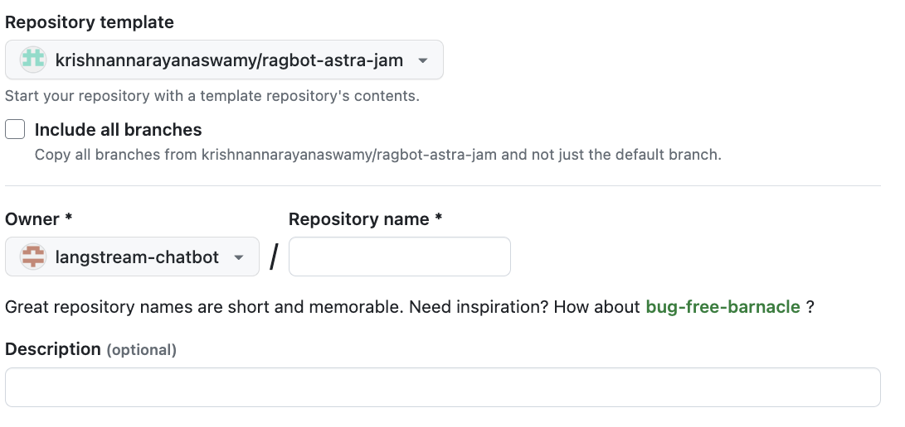

4. Cool! You just created a copy in your own Gihub account!. Clone your repository to your local machine.

### Building the Project

1. Install the dependencies by running `npm install` in your terminal.
2. Set up the following environment variables in your IDE:
    - `OPENAI_API_KEY`: Your API key for OpenAI
    - `ASTRA_DB_ID`: Your Astra DB vector database id
    - `ASTRA_DB_REGION`: Your Astra DB database region
    - `ASTRA_DB_APPLICATION_TOKEN`: The generated app token for your Astra database
        - To create a new token go to your database's `Connect` tab and click `Generate Token`. (your Application Token begins with `AstraCS:...`)

### Load Data the Project

1. Explore the ./scripts/sample_data.json file. It has a data with url, title and content.
2. Bring your own data and copy in same file in json format
3. If your structure of json file differs and the key names are different,don't stress, let us change the code in ./scripts/populateDb.ts file in the below function accordingly

```javascript
const loadSampleData = async (similarity_metric: SimilarityMetric = 'cosine') => {
  const collection = await astraDb.collection(`chat_${similarity_metric}`);
  for await (const { url, title, content} of sampleData) {
    const chunks = await splitter.splitText(content);
    let i = 0;
    for await (const chunk of chunks) {
      const {data} = await openai.embeddings.create({input: chunk, model: 'text-embedding-ada-002'});

      const res = await collection.insertOne({
        document_id: `${url}-${i}`,
        $vector: data[0]?.embedding,
        url,
        title,
        content: chunk
      });
      i++;
    }
  }
};
```

4. Populate your database with sample data by running `npm run seed` in your terminal.

### Exploring the Data

1. Now let us explore the data in Astra platform. Login to Astra platform and enable the new developer preview experience as below.


2. Click on your database and click Data Explorer and explore your data

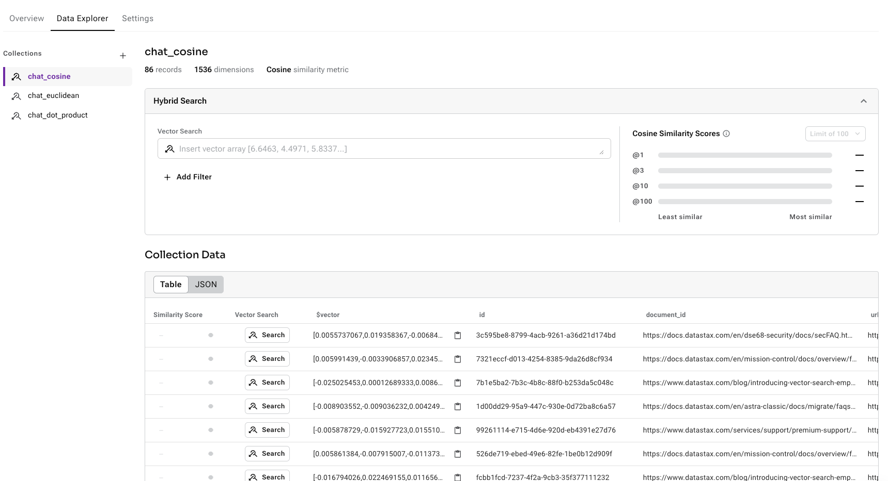


### Running the Project

To start the development server, run `npm run dev` in your terminal. Open [http://localhost:3000](http://localhost:3000) to view the chatbot in your browser.

## Deployment

You can easily deploy your chatbot to Vercel by following the instructions below:

1. Login to vercel platform and authorize your Github.

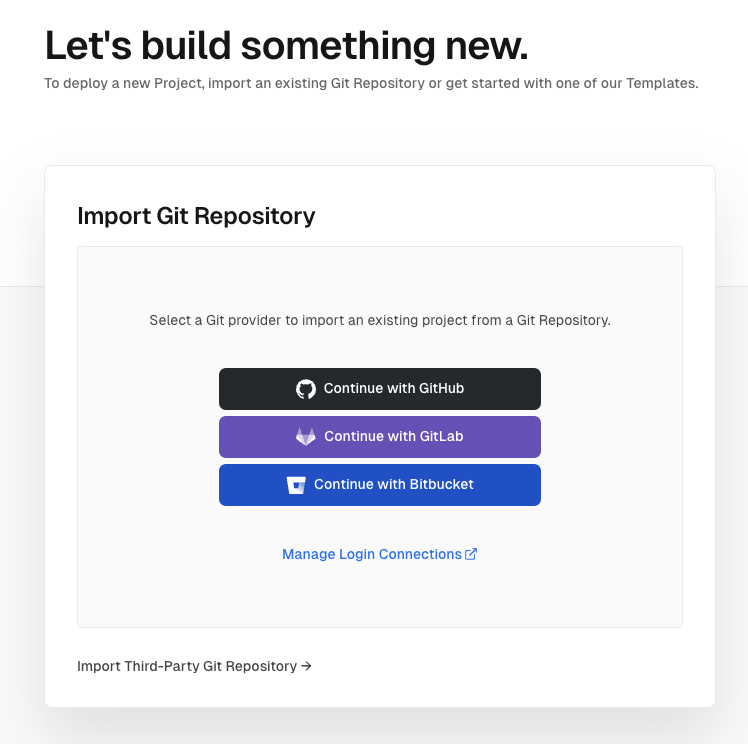

2. Import our repository as below

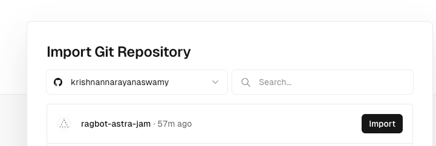

3. Deploy the project as a Vercel Next.js App 
    - Give your project a name
    - Select Next.js for the Framework 
    - Select the root directory to be ragbot as we have 2 directories
    - Provide a custom Build command - `npm run build`.Since we already loaded data previously, we will want to remove seed script (`npm run seed`) from the build step.
    - Remember to add below environment variables to the values obtained when setting up your Astra DB and OpenAI accounts.
        - `OPENAI_API_KEY`: Your API key for OpenAI
        - `ASTRA_DB_ID`: Your Astra DB vector database id
        - `ASTRA_DB_REGION`: Your Astra DB database region
        - `ASTRA_DB_APPLICATION_TOKEN`: The generated app token for your Astra database
    - Verify and Click Deploy now!


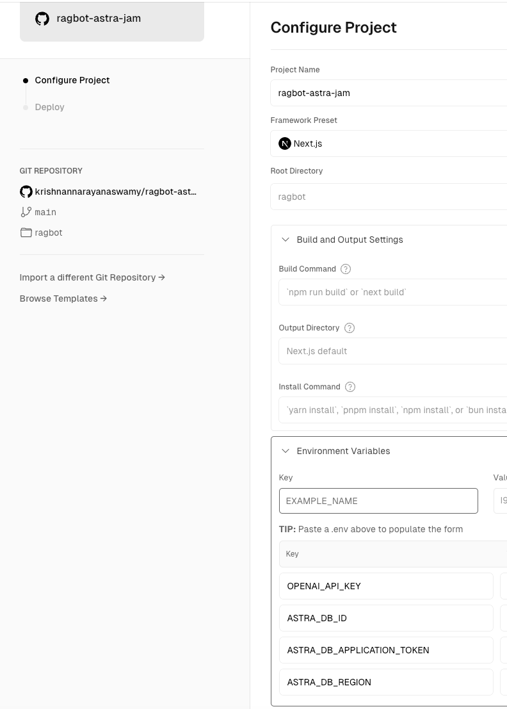

## Ops

You can easily monitor your chatbot in Vercel:

1. Login to vercel platform and click on the deployment.

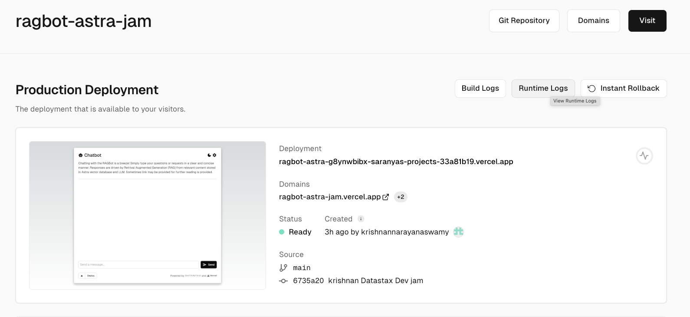

2. Click on Runtime logs button. 

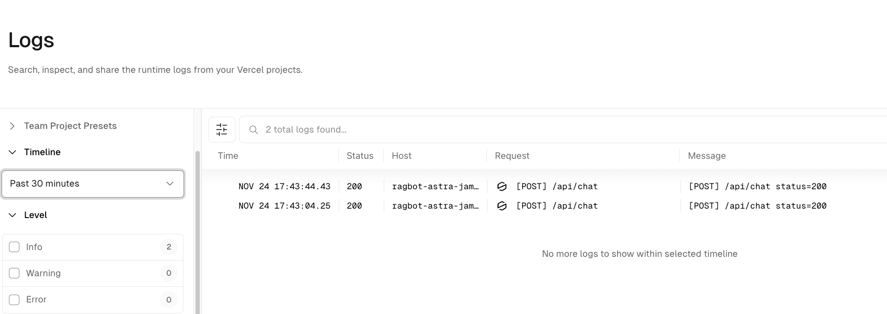

## We now have our RAGBot deployed in production. Happy Chatting!

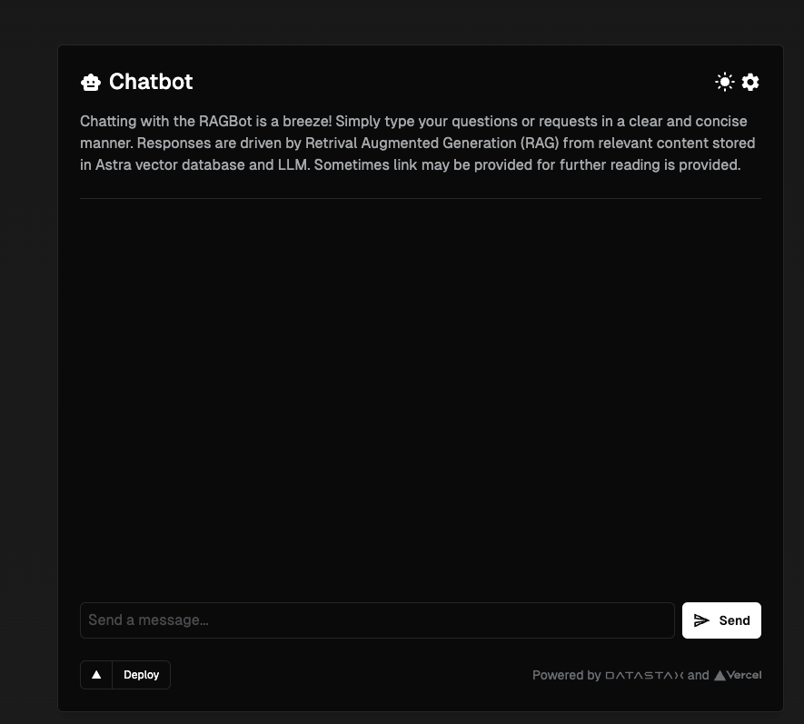

