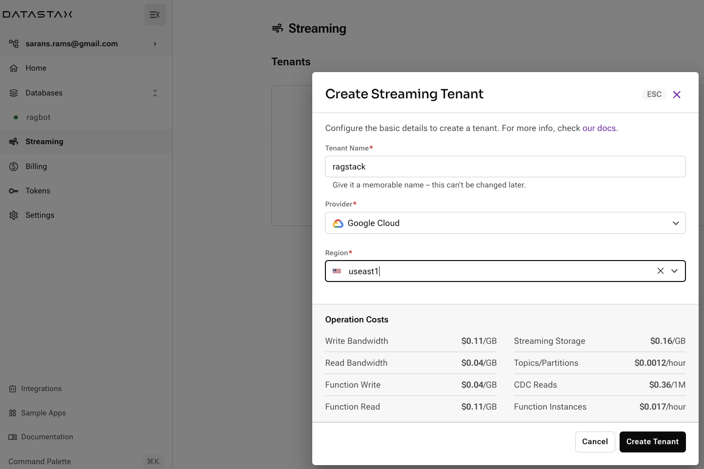
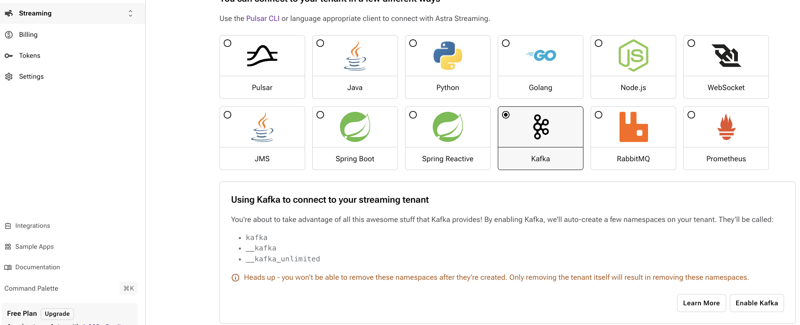
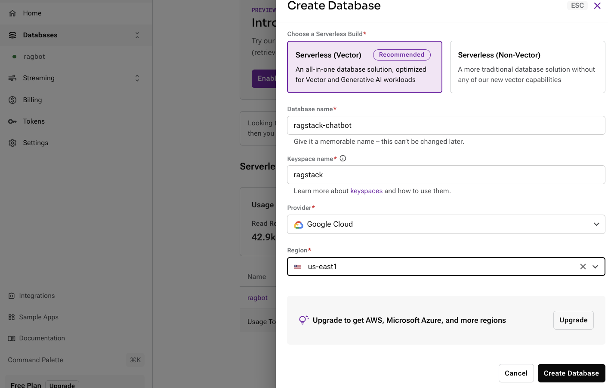
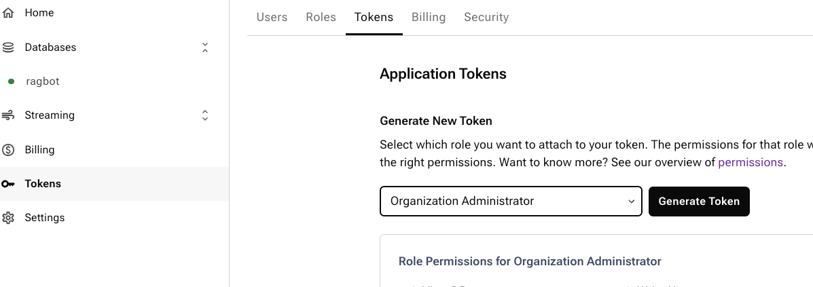

# RAGStack Astra

Welcome to DataStax Gen AI Dev Jam. This Dev Jam will help you quickly become familiar with DataStax RAGStack, LLMs and Astra Vector Database. These hands-on jam normally runs with a DataStax technical coach, self-paced and hands-on learning assignments. Bring in a Gen AI use case, your data and build a Gen AI chatbot using DataStax Astra platform.
This project is a starter for creating your production ready chatbot using Astra Vector Store, LangStream, LangChain and OpenAI. It's designed to be easy to deploy and use, with a focus on performance and usability. Let's Go!

This project covers how to:
- create a web crawler to crawl, extract webpage information, embed the documents and ingest using a pipeline with LangStream
- use Retrieval Augmented Generation (RAG) with LangChain to inquire about the contents of the webpage as they are ingested in real-time. 

## Getting Started

### Prerequisites

This workshop assumes you have access to:
1. [A Github account](https://github.com)
2. [AWS](https://console.aws.amazon.com)
3. [Astra](https://astra.datastax.com/). We signed up for Astra in our earlier part of the devjam. 
4. Install [docker](https://www.docker.com/get-started/)

#### Sign Up for AWS and create AWS Bucket. We will use the S3 bucket to store metadata of our website crawler

Create an AWS Bucket using this [guide](https://docs.aws.amazon.com/AmazonS3/latest/userguide/creating-bucket.html)
Generate a AWS secret key and access key using this [guide](https://docs.aws.amazon.com/IAM/latest/UserGuide/id_root-user_manage_add-key.html)

Gather the following information:

    - `S3_BUCKET_NAME`: Your S3 bucket name (for ex. ragstack-bucket )
    
    - `S3_ENDPOINT`: Your S3 endpoint (for ex. s3.us-east-1.amazonaws.com )

    - `S3_ACCESS_KEY`: Your S3 Access key

    - `S3_SECRET`: Your S3 secret key

    - `S3_REGION`: Your S3 region

#### Sign up for OpenAI (Skip, if you already created this in our earlier part of the devjam and want to reuse the same key)

- Create an [OpenAI account](https://platform.openai.com/signup) or [sign in](https://platform.openai.com/login).
- Navigate to the [API key page](https://platform.openai.com/account/api-keys) and create a new **Secret Key**, optionally naming the key.

#### Install LangStream

**Install LangStream:** Follow the [installation guide](https://github.com/LangStream/langstream#installation).
   
#### Create Astra Streaming Tenant

1. Login to [Astra](https://astra.datastax.com/) console.
2. Click on Streaming on the left menu and click Create Tenant. Refer [Guide](https://docs.datastax.com/en/streaming/astra-streaming/getting-started/index.html)
3. Create in the same region as our Vector Database created earlier. Refer below




4. Click on the Streaming tenant and navigate to connect tab. Enable Kafka interoperability as below




5. Download or Copy connectivity information for your streaming tenant. Gather the below information


    - `KAFKA_BOOTSTRAP_SERVERS`: Your bootstrap.servers url (for ex. kafka-gcp-useast1.streaming.datastax.com:9093 )
    
    - `KAFKA_USERNAME`: Your username endpoint (for ex. ragstack )

    - `KAFKA_PASSWORD`: Your Streaming tenant's token. Create one in your connect tab. Remember to append token: (for ex., token:****** )


#### Create Astra Database and a Token

1. Login to [Astra](https://astra.datastax.com/) console.
2. Click on Database and create a new database in the same region as the Streaming tenant as below



2. Click on Token on the left menu and select Organization Administrator toke as below. Download or Copy this information. 




3. Gather the below information


    - `ASTRA_CLIENT_ID`: Your Astra Client ID (for ex. urk... )
    
    - `ASTRA_SECRET`: Your Astra Secret (for ex. NRu.. )

    - `ASTRA_TOKEN`: Your Astra Token

    - `ASTRA_DATABASE`: Your Astra Vector DB. We already created one in previous exercise. You can reuse the same. If not feel free to create new one


#### Export all the below env properties 

```bash
export KAFKA_BOOTSTRAP_SERVERS=""
export KAFKA_USERNAME=""
export KAFKA_PASSWORD=""
export OPEN_AI_ACCESS_KEY=""
export ASTRA_CLIENT_ID=""
export ASTRA_SECRET=""
export ASTRA_TOKEN=""
export ASTRA_DATABASE=
export S3_BUCKET_NAME=
export S3_ENDPOINT=
export S3_ACCESS_KEY=
export S3_SECRET=
export S3_REGION=

```

#### Review the Configuration in the application\configuration.yaml. This sample crawls the cassio.org webpage, feel free to change this with your webpage

```yaml
configuration:
  defaults:
    globals:
      assistantType: "RAGStack project"
      vectorKeyspace: "ragbotjam"
      vectorTable: "cassiodocs"
      chatTable: "cassiohistory"
      vectorIndex: "annragbot"
      chunksTopic: "ragbotjam-chunks"
      questionsTopic: "ragbotjam-questions"
      answersTopic: "ragbotjam-answers"
      chatModelName: "gpt-4"
      logTopic: "ragbotjam-logs"
      seedUrls: 
        - "https://cassio.org/"
      allowedUrls: 
        - "https://cassio.org/"
      forbiddenPaths: []
      vectorDb: ""

```

